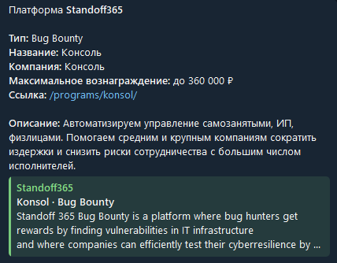

# BugBountyHelper
## Развертывание

Установить зависимости.
```bash
pip3 install -r requirements.txt
```

Создать `.env` файл с конфигурацией бота по примеру ниже.
```.env
# tg bot token
APP__BOT_TOKEN=<TOKEN>

#  url for standoff365
APP__BUG_BOUNTY_URL=https://bugbounty.standoff365.com

# tg user id
APP__USER_ID=<YOUR_TG_ID>

# INTERVAL for checking for news programs
APP__CHECK_INTERVAL=600  # time in sec

# LOGGING
LOGGING__LEVEL=DEBUG
LOGGING__FILE_PATH=bot.log
```

Создать демона на linux сервере для постоянной работы бота по примеру данной [статьи](https://thecode.media/systemctl).


## Пример работы

С указанной периодичностью бот парсит первые две страницы программ на сайте.  
При появлении новой программы бот уведомит в личных сообщениях.  


